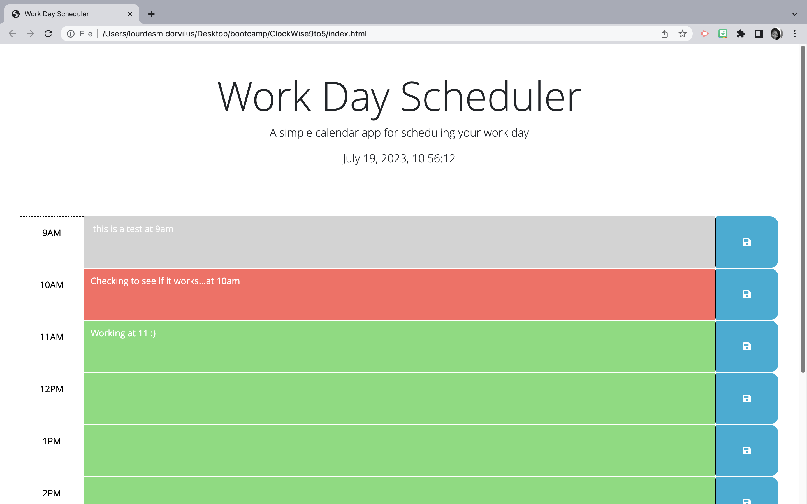

# 9to5Scheduler

The assignment/task was to create a Work Day Scheduler, a simple calendar application that allows a user to save events for each hour of a typical working day (9am–5pm). The application needed to run in the browser and feature dynamically updated HTML and CSS powered by jQuery. The starter code provided included the Day.js library for working with date and time.

The motivation behind building this project was to create a useful tool for managing and organizing daily schedules. As an employee with a busy schedule, it can be challenging to keep track of important events and tasks throughout the day. By developing a Work Day Scheduler, I aimed to provide a solution that allows users to add and manage their events effectively, ensuring they can make the most of their time.

The Work Day Scheduler solves the problem of managing and organizing a busy schedule by providing a user-friendly interface to add and save events for each hour of the working day. It allows users to see the current day at the top of the calendar, provides color-coded time blocks to indicate past, present, and future events, and enables users to enter and save event details. The saved events persist even after refreshing the page, ensuring that users can rely on the scheduler to keep their schedules organized.

During the development of this project, I learned several key aspects. Firstly, I gained experience in working with the Day.js library for manipulating and displaying dates and times. Additionally, I improved my understanding of using jQuery to dynamically update HTML and CSS elements based on user interactions and current time. Lastly, I honed my skills in utilizing local storage to store and retrieve data, enabling the persistence of saved events even after page refreshes. Building this project allowed me to practice and enhance my skills in JavaScript, jQuery, HTML, CSS, and working with third-party libraries and APIs.which would increase my chances of impressing potential employers.

## Table of Contents

Paragraph 1: What was the assignment or task?
Paragraph 2: What was your motivation?
Paragraph 3: What problem does it solve?
Paragraph 4 What did you learn? Why did you build this project?

### Installation

N/A

### Usage

Post video Here!

picture of scheduler website!
Work Day Scheduler created with HTML, CSS and Javascript. Use this Link: Use This Link to View Live Preview `
Credits: Team Work Make the Dream Work! We worked together systematically on zoom totaling a total of 15+ Hours Phil Loy, Instructor Lourdes Dorvilus <https://github.com/lo-mido> & Tutor Support via ABC Learning Application

Tutorial Links: <https://courses.bootcampspot.com/courses/3883/assignments/57119?module_item_id=1004720> <https://www.w3schools.com/css/css_selectors.asp> <https://www.w3schools.com/html/html_attributes.asp> <https://htmlcheatsheet.com/css/> <https://apps.apple.com/us/app/mimo-learn-coding-programming/id1133960732?ppid=36dc2281-6a01-4f94-ad52-05a0a7062255> <https://youtu.be/tRZGeaHPoaw>

### License: MIT License

Copyright (c) 2023 Lourdes Dorvilus

Permission is hereby granted, free of charge, to any person obtaining a copy of this software and associated documentation files (the "Software"), to deal in the Software without restriction, including without limitation the rights to use, copy, modify, merge, publish, distribute, sublicense, and/or sell copies of the Software, and to permit persons to whom the Software is furnished to do so, subject to the following conditions:

The above copyright notice and this permission notice shall be included in all copies or substantial portions of the Software.

THE SOFTWARE IS PROVIDED "AS IS", WITHOUT WARRANTY OF ANY KIND, EXPRESS OR IMPLIED, INCLUDING BUT NOT LIMITED TO THE WARRANTIES OF MERCHANTABILITY, FITNESS FOR A PARTICULAR PURPOSE AND NONINFRINGEMENT. IN NO EVENT SHALL THE AUTHORS OR COPYRIGHT HOLDERS BE LIABLE FOR ANY CLAIM, DAMAGES OR OTHER LIABILITY, WHETHER IN AN ACTION OF CONTRACT, TORT OR OTHERWISE, ARISING FROM, OUT OF OR IN CONNECTION WITH THE SOFTWARE OR THE USE OR OTHER DEALINGS IN THE SOFTWARE.

### How to Contribute

Lourdes M. Dorvilus

### Testing

Tests Using VS Code & GIT HUB to host the webpage.
